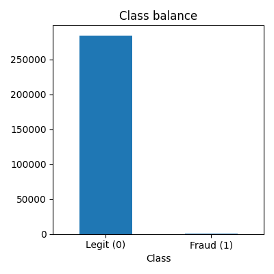
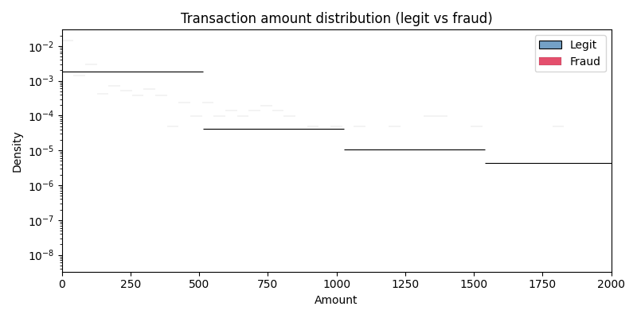
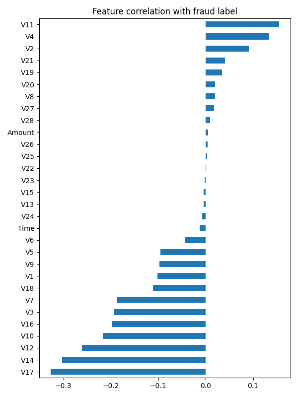

# Phase 1 — EDA Findings

Dataset: Kaggle `mlg-ulb/creditcardfraud` (284,807 rows x 31 columns)

## Shape & quality
- Rows: 284,807, Columns: 31
- Missing values: 0 (none)
- Columns: `Time`, `V1`..`V28` (PCA-anonymized), `Amount`, `Class`

## Class imbalance
- Legit: 284,315 (99.827%)
- Fraud: 492 (0.173%)
- This is a ~577:1 imbalance — standard accuracy is meaningless here;
  use PR-AUC / recall-at-precision as the evaluation metric, and address imbalance
  in Phase 2 (SMOTE / class weighting) before training the supervised model.

## Amount
- Legit mean amount: 88.29, median: 22.00
- Fraud mean amount: 122.21, median: 9.25
- Fraud amounts skew lower and are more concentrated in the small-transaction range
  (see plot) — `Amount` alone is a weak signal but worth scaling and keeping as a feature.

## Time
- Data spans 48.0 hours (2.0 days) as seconds elapsed since the first transaction.
- No per-user/account ID is present in this dataset — `Time` is the only ordering signal,
  so Phase 2's rolling/lag features will be computed on transaction order rather than
  a real per-account key (this dataset doesn't provide one; noted as a limitation, not
  something to work around here).

## Feature correlation with fraud (`Class`)
- V1-V28 are already PCA components (anonymized for privacy), so they aren't individually
  interpretable, but several are strongly predictive:
  - Most positively correlated: V19 (0.03), V21 (0.04), V2 (0.09), V4 (0.13), V11 (0.15)
  - Most negatively correlated: V17 (-0.33), V14 (-0.30), V12 (-0.26), V10 (-0.22), V16 (-0.20)

## Implications for later phases
- **Phase 2**: handle severe class imbalance (SMOTE on training fold only, or class
  weights); scale `Amount`/`Time`, engineer rolling features on transaction order.
- **Phase 3/4**: PR-AUC and recall@precision are the metrics to optimize for and report,
  not accuracy — with 0.173% positive rate, a model predicting all-legit would
  score 99.83% accuracy while catching zero fraud.
- No missing values, no dtype cleanup needed — data is already clean.
