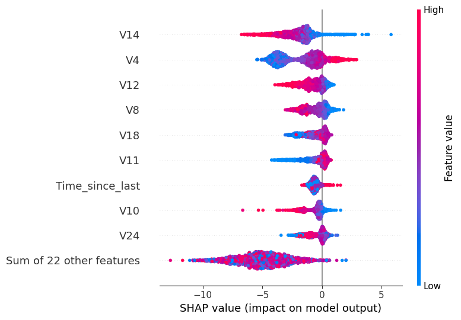

# Phase 4 — Explainability (SHAP)

## Setup
- `shap.TreeExplainer` on the trained XGBoost model (C:\Users\asus\Desktop\transaction\transaction-anomaly-detector\models\xgb_fraud.joblib)
- Global summary computed on a random sample of 2,000 test rows
  (TreeExplainer is exact for trees; the sample only keeps the plot/report fast to generate)

## Global feature importance (mean |SHAP value|)
| Feature | Mean \|SHAP\| |
|---|---|
| V14 | 2.1888 |
| V4 | 1.9793 |
| V12 | 0.9060 |
| V8 | 0.7891 |
| V18 | 0.7548 |
| V11 | 0.6958 |
| Time_since_last | 0.6457 |
| V10 | 0.6383 |
| V24 | 0.6289 |
| V3 | 0.6113 |

## Case-level explanations
- **True positive** (row correctly flagged as fraud): `figures/shap_case_true_positive.png`
- **False negative** (fraud the model missed): `figures/shap_case_false_negative.png`

Each waterfall plot shows how each feature pushed that single transaction's score
up (toward fraud) or down (toward legit) from the model's base rate.

## Implications
- V14, V17, V12 and other PCA components already flagged in Phase 1's correlation
  analysis are expected to dominate here too — SHAP confirms whether the model is
  actually relying on the same signals, or picking up something spurious.
- Use the false-negative case plot to see what suppressed the fraud score on a
  missed case — useful for deciding whether a lower decision threshold
  (see Phase 3's threshold table) is worth the added false positives.
